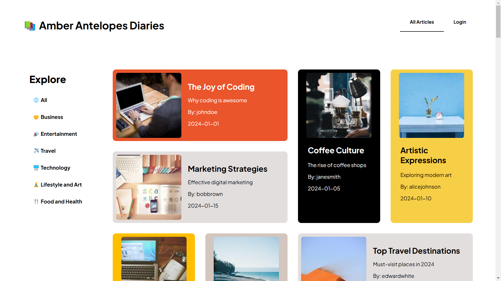

# A personal blogging system

## Objective

The objective of this team project was to demonstrate the application of full-stack technologies acquired in our postgraduate ICT course by developing a personal blogging platform. This platform required a secure login system, an SQL database to handle CRUD operations for users, articles, and comments, and a structured backend to support these features. The project was designed to simulate a real-world environment, involving collaboration with peers under a tight timeframe.

## Personal Contributions:

As the elected team leader, I was responsible for overseeing all project tasks and troubleshooting issues, which allowed me to gain practical experience across all project areas. My specific contributions included:

-	Drafted our initial project roadmap
-	Managed and updated Trello board
-	Developed ERM
-	Drafted API routes and endpoints
-	Assisted with setting up SvelteKit route structures
-	Researched themes, colour palettes, and CSS example
-	Implemented authorisation, login, account systems with CRUD features
-	Coordinated workflow and task allocation
-	Supported team members in problem-solving
-	Tested features throughout implementation
-	Developed and refined CSS styling across multiple pages
-	Researched and integrated a WYSIWYG text editor (Quill.js)
-	Added extra features such as modal confirmation screen and article category sidebar
-	Assisted with implementation of articles and comments CRUD features

## Applied Learnings:

- Project required knowledge of Git, HTML, CSS, JavaScript, Svelte & SvelteKit, Node.js & Express, SQLite, Cookies.
- Git was used extensively for version control and was used to update the shared repository regularly.
- Frontend Development:
    - HTML, CSS, JavaScript, Svelte (& SvelteKit) used for frontend
    - Authorisation & Login: Implemented with JSON Web Tokens (JWT) and cookies
    - HTML Forms: Used extensively for creating articles, comments, and user data
    - Layout: Flexbox and Grid layouts used in nearly all SvelteKit routes
    - Key Frontend Techniques:
        - Reusable Svelte components
        - Implemented Quill.js as rich text editor for articles
        - #each/#if blocks
        - Bindings, custom events, AJAX, Fetch API
    - Backend Development:
        - Node.js Express and SQLite used on the backend
        - Applied bcrypt library, a secure password-hashing algorithm, to safely store user passwords in our database.
        - Database: Built on an Entity-Relationship Model (ERM) accessed through Express routes
        - Authorisation: Custom middleware for request handling to check user authentication
        - Data Validation: Used Yup schema for validation in DAOs
        - Testing: Regular testing of API endpoints in Postman to ensure bug-free frontend-backend connectivity
        - Database Security: Parameterized SQL queries used to minimize security risks

## Screenshots of our website:

### My Articles page:

### Create Article page:

### Comments page:

